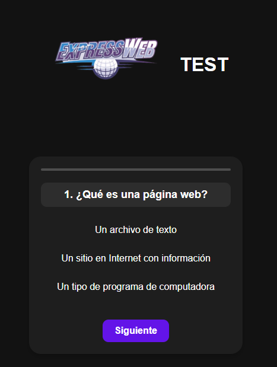

> [!NOTE]
>Version BETA
# Test ExpressWeb

Este proyecto es una aplicación web de prueba que permite a los usuarios responder preguntas sobre conceptos básicos de páginas web. La aplicación muestra un cuestionario con preguntas de opción múltiple y calcula la puntuación del usuario al final.

## Características

- Cuestionario con preguntas de opción múltiple.
- Progreso visual del cuestionario.
- Cálculo de la puntuación del usuario.
- Diseño responsivo y centrado.

## Tecnologías utilizadas

- HTML
- CSS
- JavaScript

